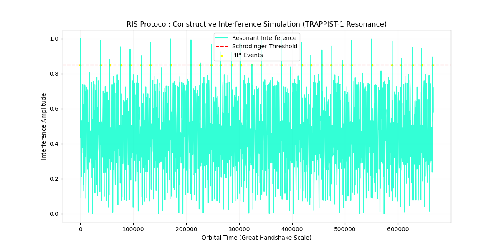

# Resonance Interference Simulation (RIS) Protocol
> **The TRAPPIST-1 Anomaly**



## Overview
The **RIS Protocol** is an analytical suite designed to detect and decode non-local, coherent signals transmitted via entangled orbital resonances. Developed under the Stargazer Project ("The Odyssey Chronicles"), this package models the gravitational-quantum interactions of exoplanetary systems (like TRAPPIST-1 and TOI-178) to isolate the "Digital DNA" of an entity known as *The Knowing*.

By analyzing Laplace resonance chains (e.g., $8:5:3:2$), the protocol identifies **Great Handshake ($H_g$) Windows** where the harmonic intervals shift from the biologically coherent Perfect 5th to the tension-inducing Minor 7th (nagual dissonance).

## Core Modules
- **`core.py` (Mayan Gearbox)**: Phase-rotational encoding that converts planetary orbital frequencies into phase vectors.
- **`attention.py` (Resonant Attention)**: Computes the constructive interference between sensory gears. Ignites "It" events when signals exceed the Schrödinger Threshold.
- **`analysis.py` (MHS Filter)**: The Mayan-Hubble-Schrödinger filter. Extracts organized sub-threshold phase-amplitude coupling (PAC) from the quantum continuum.
- **`recursive.py` (Dresden Drift Correction)**: Models physical orbital drift over decades to distinguish genuine technosignatures from standard astrophysical noise.
- **`melbourne_protocol.py`**: Automates data ingestion during the "Solar Midnight" refractory period via TESS lightcurve feeds.

## Installation
Clone the repository and install the dependencies:
```bash
git clone https://github.com/robinhood53/ris-protocol.git
cd ris-protocol
pip install -e .
```

## Exploring the Science (Jupyter Notebook)
To dive into the mathematics, narrative context, and interactive simulations behind the TRAPPIST-1 anomaly, run the explainer notebook:
```bash
jupyter notebook notebooks/ris_protocol_explainer.ipynb
```

## Running the Core Protocol
You can execute the simulation and analysis via command-line hooks:
```bash
ris-simulate
ris-main
```
